# architecture

cradle codec is an apache-2.0 systems project for moving and restoring llm kv-cache state across storage and network boundaries. it treats a cache as a structured attention tensor rather than an opaque byte stream, then maps token-adjacent values into video frames so established video-coding hardware can remove redundancy. on supported nvidia systems, nvenc and nvdec provide a codec path that does not directly consume the cuda cores used for inference.

the engineering objective is reliable cache reuse under real serving constraints: finite link bandwidth, heterogeneous accelerators and drivers, cache-placement decisions, and contention with foreground inference. the current implementation provides inspectable artifacts, local and http transport paths, an optional gstreamer gdp/tcp packet transport, three codec backends, and an lmcache storage plugin. it does not yet provide the fully overlapped, gpu-memory-native remote-fetch path described in the [roadmap](roadmap.md).

## data flow

prefill creates a kv cache for each attention layer. a later request that shares a prefix can avoid recomputing that prefix if the serving system can locate, transfer, decode, and restore the corresponding cache state cheaply enough. cradle codec focuses on that state-transfer path.

the canonical in-process shape is `[2, L, T, H, D]`: k/v side, layers, tokens, kv heads, and head dimension. video backends consume frame batches shaped as `[frames, height, width, 3]`.

```mermaid
flowchart LR
    A[Canonical KV cache<br/>2 x layers x tokens x heads x dim] --> B[Layout packer<br/>token axis becomes time]
    B --> C[Quantized frame batches<br/>uint8 planes]
    C --> D[Codec backend<br/>PyNvVideoCodec, FFmpeg, or reference]
    D --> E[Artifact<br/>manifest + independent parts]
    E --> F[Local store or HTTP fetch]
    F --> G[Decode and dequantize]
    G --> H[Layout restore]
    H --> I[Canonical KV cache<br/>or LMCache memory object]
```

## tensor layout

for each k/v side and each contiguous layer group, token index becomes frame index. up to three adjacent layers occupy the frame channels. the `[H, D]` plane is tiled into height and width while preserving head order and the order of values within each head. this gives inter-frame prediction a token-adjacent sequence without mixing attention-head feature spaces.

the layout is explicit and recorded in the artifact manifest, so packing and restoration are deterministic. candidate-layout helpers exist, but the project does not yet run a comprehensive model-specific layout search or emit several resolution variants for every artifact by default.

## quantization and codec backends

hevc backends need integer frame planes. the current quantizer maps floating-point kv values to `uint8` and records min/max metadata at the configured `part`, `frame`, or `channel` axis. this conversion is numerically lossy even when hevc preserves the quantized pixels exactly. a lossless hevc setting therefore does not imply bit-exact restoration of the original floating-point tensor.

the backends have distinct roles:

- `pynvvideocodec` uses pynvvideocodec for hevc yuv444 encode and decode through nvenc/nvdec when the installed package, driver, gpu, and format support are compatible. it pads small logical frames when hardware decode requires larger dimensions and currently converts decoded frames into numpy arrays before restoration. unsupported nvdec remains visible as an error rather than silently changing to a cpu path.
- `ffmpeg` is an explicit compatibility backend for environments where the nvidia path is unavailable or for artifact debugging. it is not the gpu-native performance path.
- `reference` stores checksummed raw `uint8` frame bytes. it isolates layout, manifest, storage, fetch, and restoration behavior from video dependencies, but it still uses the configured quantization path and therefore does not preserve the original floating-point values exactly.

## artifact boundary

an artifact is a directory containing `manifest.json` and independently decodable payloads under `parts/`. the manifest records the source key, model, canonical kv shape, layout, quantization metadata, codec parameters, checksums, and relative payload paths. named variants may describe alternative layouts or resolutions.

this artifact boundary separates tensor transformation from storage and serving. a contributor can inspect or decode an artifact without starting vllm, serve it over http, compare explicit codec backends, or evolve layout and quantization policy without changing the transport protocol. checksum validation makes transfer and storage corruption fail visibly.

## storage and remote fetch

`LocalArtifactStore` maps stable source keys to artifact directories. the remote service exposes a small read-only http protocol: fetch a manifest by source key, then fetch the payload paths listed by that manifest. the remote controller validates payloads, decodes selected parts, and restores the canonical kv array.

variant selection is currently a deterministic cost calculation over manifest metadata, a supplied bandwidth estimate, and an optional switch penalty. transfer, decode, and restore timings are reported separately. the http path crosses a real transport boundary, but it is not yet a production disaggregated cache service: it does not continuously adapt from measured link state, pipeline transfer with frame decode, or write decoded frames directly into vllm paged memory.

the current networking environment establishes a practical 10 gbe baseline for artifact transport and systems measurements. broader conclusions require bandwidth-shaped validation with latency, jitter, and loss profiles beyond the local data-center link, which is a future milestone rather than a current capability.

## gstreamer packet transport

the optional `gstreamer` module adapts the repository's existing python sender/receiver design into a packaged gdp-over-tcp transport. `GStreamerPacketSender` pushes complete byte packets through `appsrc`, `gdppay`, and `tcpserversink`; `GStreamerPacketReceiver` uses `tcpclientsrc`, `gdpdepay`, and `appsink`, then forwards each owned byte string to a `PacketConsumer`. imports are lazy, missing plugins fail explicitly, client attachment is bounded by a timeout, and the receiver preserves asynchronous bus and consumer failures for the caller.

this is deliberately separate from the codec hot path. it provides packet framing and transport plus a runnable loopback check; it does not make gstreamer an artifact codec, perform nvdec, expose cuda surfaces, or write decoded frames into vllm paged memory. the native frame-wise pipeline remains a roadmap item.

## lmcache and vllm integration

the python package and lmcache plugin are named `cradle_codec`; source lives under `src/cradle_codec`. when lmcache stores a kv chunk, the plugin converts the lmcache tensor into the canonical layout, encodes an artifact, and records it under the configured artifact root. on retrieval, it decodes the artifact and restores the tensor shape lmcache expects.

the `live vllm-lmcache` command configures this plugin, starts vllm, sends repeated requests, and writes a timing report. a successful smoke run demonstrates plugin loading, artifact creation from an initial request, and cached-token reuse on a repeated request using a real model and serving stack.

the integration remains storage-oriented. decode currently completes frame batches through python, numpy, and lmcache memory objects. fetch discovery, request-state transitions, scheduler wakeups, decode-pipeline ownership, preallocated destination slots, and direct paged-memory writes are not yet integrated into the complete request lifecycle.

## package boundaries

the modules reflect the runtime boundaries:

- `layout` packs canonical tensors into frame batches and restores them.
- `quant` converts floating-point values to integer planes and back.
- `codec` owns payload encoding and decoding.
- `manifest` defines and validates self-describing artifacts.
- `pipeline` composes layout, quantization, codec, and artifact operations.
- `store`, `remote`, and `fetch` cover local persistence, http transport, selection, and restoration.
- `gstreamer` provides the optional gdp/tcp sender, receiver, runtime probe, and loopback transport.
- `integration` connects the artifact path to lmcache and vllm.
- `cli` exposes the supported workflows through the `cradle-codec` distribution command.

these boundaries let reliability, networking, data-center integration, and heterogeneous-hardware work proceed independently without creating competing artifact formats. for runnable workflows, see [usage](usage.md) and [verification](verification.md). future systems work is tracked in the [roadmap](roadmap.md).
